# 🌾 Farmers Crop Disease Detection System – AgriTech

## 🚀 Overview

Farmers Crop Disease Detection System – AgriTech is an AI-powered web application developed to help farmers identify crop diseases at an early stage using Deep Learning and receive intelligent recommendations for crop management.

The platform allows farmers to upload crop images, detect diseases using a trained Inception CNN model, and obtain actionable insights such as growth tips, care instructions, and pesticide recommendations. The system also includes an administrative portal for user verification and management.

**Project Type:** Team Project

---

## ✨ Key Features

### 👨‍🌾 Farmer Module

* Farmer Registration & Login
* Profile Management
* Crop Disease Detection
* Image Upload & Preview
* Prediction History
* AI-Powered Recommendations
* Multilingual Support

### 🛡️ Admin Module

* Admin Authentication
* User Verification
* Pending User Approval
* Dashboard Analytics
* Feedback Monitoring

### 🤖 AI & Machine Learning

* Inception CNN Model
* Crop Disease Classification
* Intelligent Recommendation Generation
* Performance Metrics Visualization

---

## 🛠️ Tech Stack

### Frontend

* HTML5
* CSS3
* Bootstrap
* JavaScript

### Backend

* Django
* Python

### Database

* SQLite

### Machine Learning

* TensorFlow
* Keras
* Inception CNN

### APIs

* Perplexity AI API

---

## 📸 Project Screenshots
### 🏠 Home Page

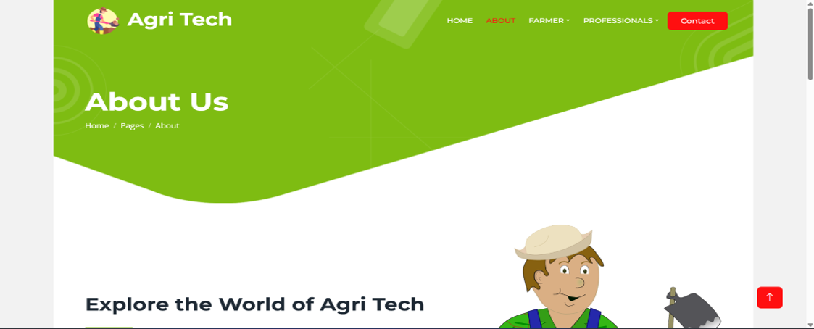

### ℹ️ About Page

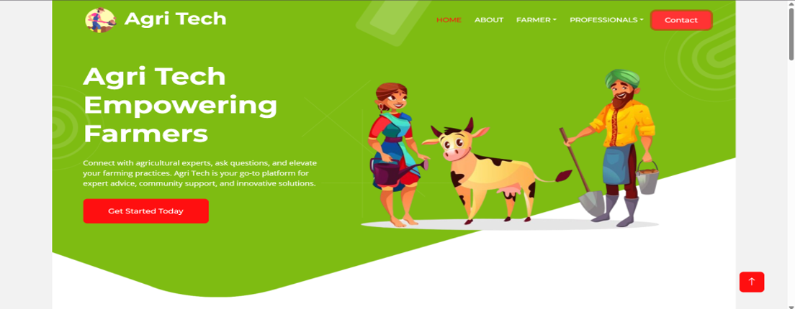

### 👨‍🌾 Farmer Registration

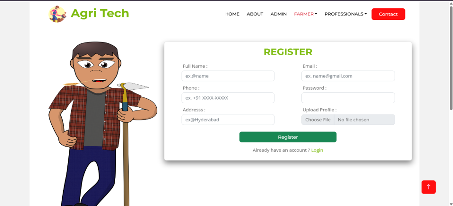

### 🔐 Farmer Login

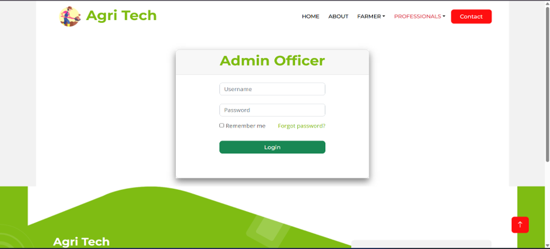

### 🛡️ Admin Login

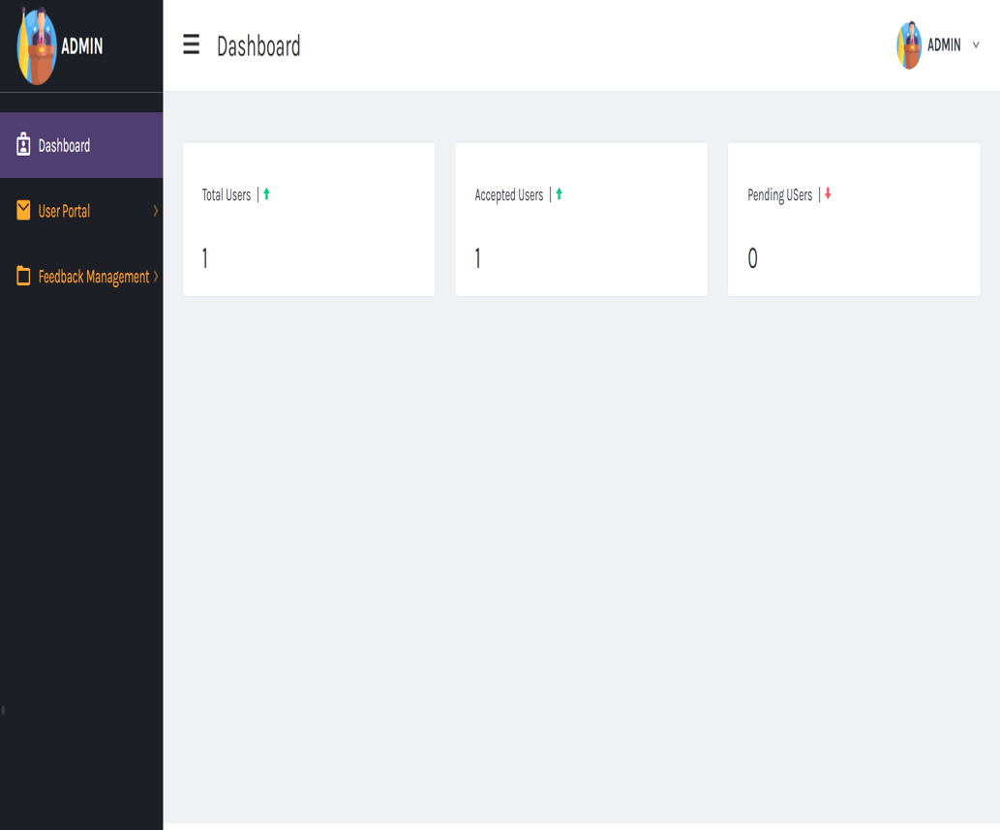

### 📊 Admin Dashboard

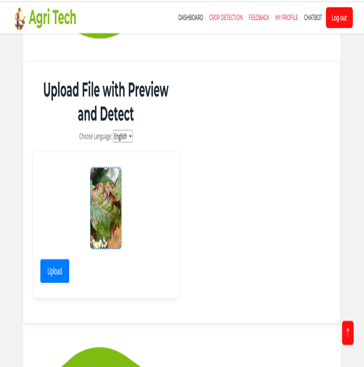

### 📤 Disease Detection Interface

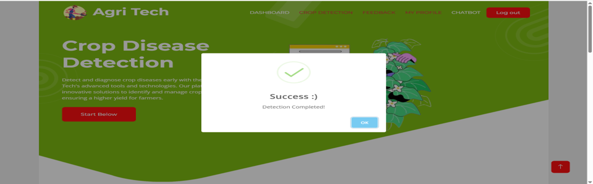

### ✅ Prediction Success

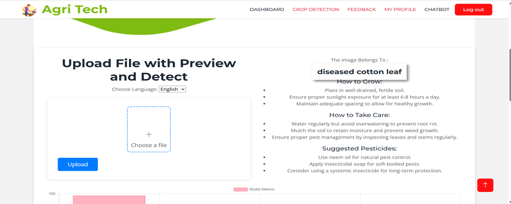

### 🧠 Disease Prediction & Recommendations

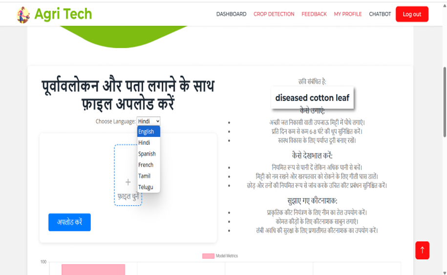

### 🌍 Multilingual Support

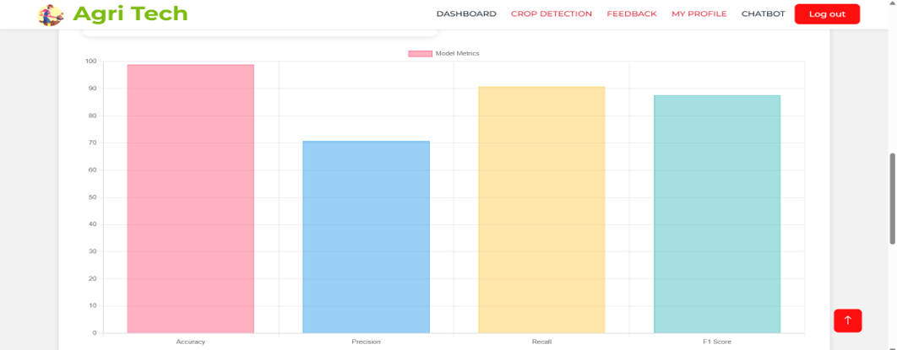

### 📈 Model Performance Metrics

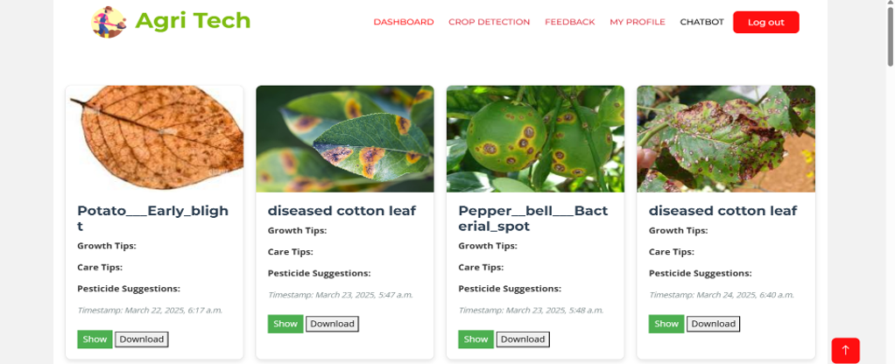

### 📚 Prediction History

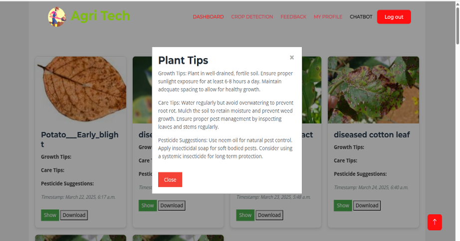

### 🌱 Detailed Plant Recommendations

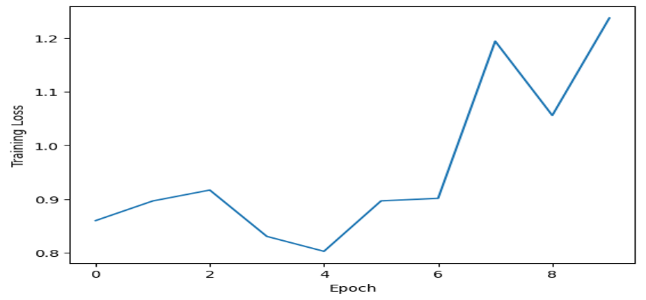

### 📉 Training Loss Visualization

